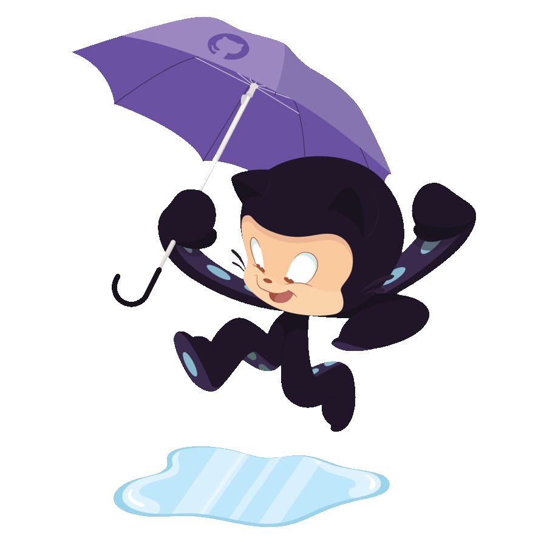

<h2 align="center">Hi, I'm Diego Silva, <image src="image/wave.gif" width="29"> welcome to my perfil!</h2>

  
  
  

<h3><strong>About Me</strong></h3>

<li><b>[👾] • Fullstack web programmer, trying to stay focused on the backend.</b></li>
<li><b>[🤖] • I'm currently studying javascript and aligning my basic knowledge.</b></li>
<li><b>[👨‍🎓] • Studying systems analysis and development in IFTM (Instituto Federal do Triangulo Mineiro)</b></li>

<!-- TECNOLOGIAS -->

<h3><strong>Languages and Tools</strong></h3>

  

  

  

